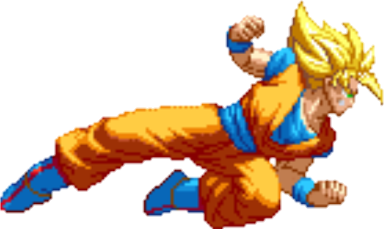

# dragonball-progressbar

This plugin is made for fun and is still WIP (05.01.2023).

Sprites belong to:

* https://www.spriters-resource.com
* https://www.deviantart.com/tag/gokusprites
* https://slackmojis.com/

Icon source: https://de.m.wikipedia.org/wiki/Datei:Dragonball_%284-Star%29.svg

<!-- Plugin description -->
This plugin replaces the progressbar with a dragonball themed progressbar. Feel free to leave GitHub issues :)

In the preferences page there is a new entry to set the desired sprite.

<!-- Plugin description end -->

## Currently existing sprites

## Installation

- Using IDE built-in plugin system:

  <kbd>Settings/Preferences</kbd> > <kbd>Plugins</kbd> > <kbd>Marketplace</kbd> > <kbd>Search for "
  dragonball-progressbar"</kbd> >
  <kbd>Install Plugin</kbd>

- Manually:

  Download the [latest release](https://plugins.jetbrains.com/plugin/19789-dragonball-progress-bar/versions) and install it
  manually
  using
  <kbd>Settings/Preferences</kbd> > <kbd>Plugins</kbd> > <kbd>⚙️</kbd> > <kbd>Install plugin from disk...</kbd>

---
Plugin based on the [IntelliJ Platform Plugin Template][template].

[template]: https://github.com/JetBrains/intellij-platform-plugin-template
